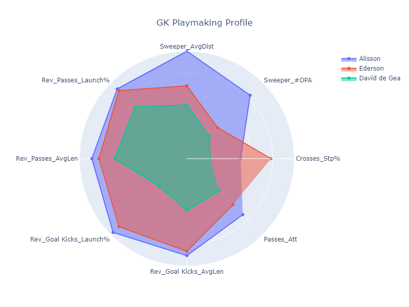
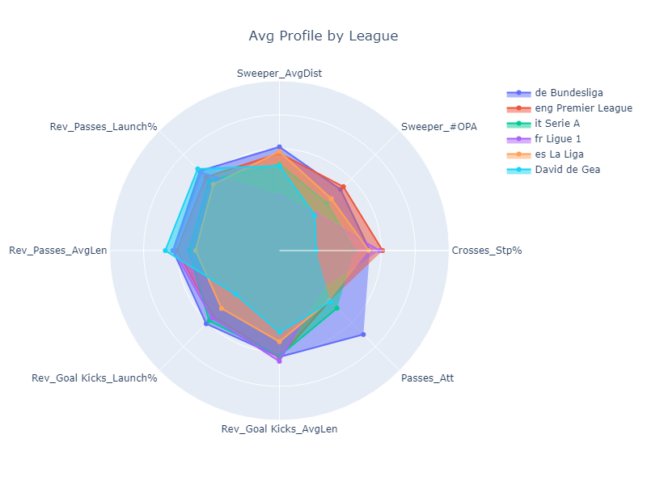
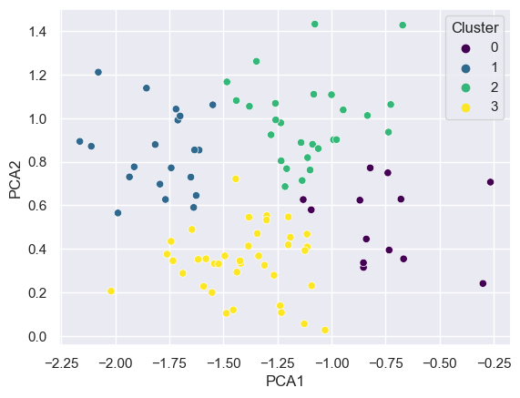
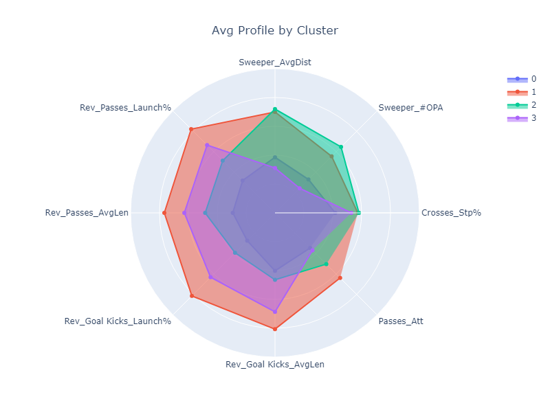
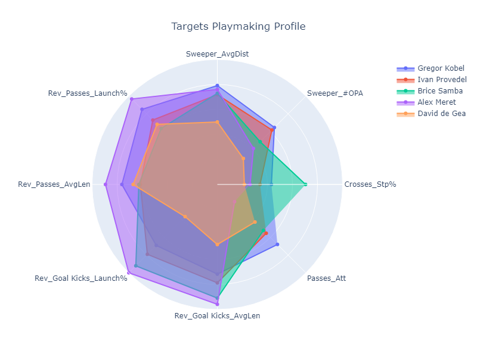
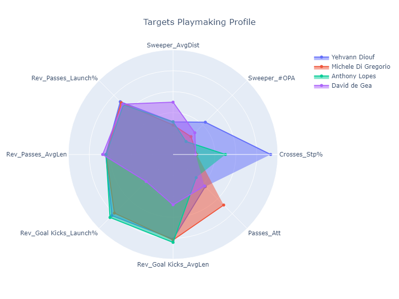

## Using Machine Learning to Find Playmaking Goalkeepers

Last thursday's debacle appeared to be the nail in the coffin for David De Gea. At least from a fan's perspective. The reality is, we will never be able to reach the recent heights that Manchester City and Liverpool have reached, without a playmking goalkeeper.

It is extremely clear that ETH wants us to build from the back more, but this process is impeded by DDG's on the ball abilities. So I decided to use some simple machine learning algorithms to try to seeth through all the goalkeepers in the top 5 leagues, and identify viable, playmaking GK targets.

All data comes from: https://fbref.com/en/comps/Big5/keepersadv/players/Big-5-European-Leagues-Stats

---
## The Metrics

Before I go into the metrics used, let me clarify something. On all my charts, I want the high value to mean "good." However, some values, like "Avg Length of Pass" are "good" when they're smallest - as this would indicate a GK's tendency to play shorter passes. So I've reversed those values on the charts so that a high value still means good. This is why some variables, (listed below) start with the prefix "Rev." Note also that all values on the charts have been standardized (scaled to be between 0 and 1.)

If this is too confusing, just remember this - on the charts, the higher the value looks, the "better" it is for that metric for a playmaking GK.

I will evaluate playmaking keepers based on 8 metrics, listed below. All stats per 90.

* **Passes_Att**: The number of passes attempted, not including GK.

* **Rev_Goal Kicks_AvgLen**: The average length of a Goal Kick pass. 

* **Rev_Goal Kicks_Launch%**: The percentage of Goal Kicks that were launched (passes greater than 40 yards). 

* **Rev_Passes_AvgLen**: The average length of a **Non** Goal Kick pass. 
  
* **Rev_Passes_Launch%**: The percentage of **Non** Goal Kicks passes that were launched (passes greater than 40 yards). 

* **Sweeper_AvgDist**: The average distance from goal in all defensive actions.

* **Sweeper_#OPA**: Defensive actions outside of the penalty area.

* **Crosses_Stp%**: Percentage of crosses in the penalty area that were successfully stopped by the GK.
---
## The Problem

### Far from the Elite

So let's see how DDG compares to two of the best playmaking goal keepers, Alisson and Ederson. Note that I'm not doing this to harp on DDG. I just want to show how these metrics really are reflective of playmaking GKs, and establish a foundation for what we need to look out for.

To the surprise of absolutely no one, Alisson and Ederson far outperform DDG in all metrics. They play more passes per game, shorter passes both from goal kicks and open play, launch a much smaller percentage of both goal kicks and open play passes (suggesting a higher tendency for short passes.) They are also both better sweeper keepers, although Alisson is a much better sweeper keeper than Ederson. But they both have very good command of their penalty box.

### Inability to Build up from Goal Kicks

Now, it feels a little unfair to compare him to two of the best playmaking GKs, so let's compare him to the average keeper across the top 5 leagues.

So there are a lot of things that are bad here. Overall, he's basically worst than the average GK in all the top 5 leagues. But there are certain areas that are more important that others. He's slightly above average in open play passes, but when it comes to goal kicks, he's far worst than the rest. 

This essentially means that we end up launching most of our goal kicks, which takes away from our inability to play from the back. Notice also how his passes attempted are very low, suggesting that he has very minimal involvement in the build up.

### Takeaway

Okay so, now, hopefully, you will trust that those metrics are indicative of playmaking GK. And understand what we are really missing with DDG. So time for the machine learning to come in.

## Clustering Analysis.

So, we will use a very basic clustering analysis here, called K-means. I'm not going to go in the details of teh algorithm or other steps that I took to run it, but at a high level, K-means is an algorithm that finds clusters of goalkeepers with similar abilities. 

The goal is that one of those clusters comprises of goalkeepers with good playmaknig attributes, like Alisson and Ederson. And then, we can do a deep dive into goalkeepers into that cluster to find out who we should be targetting.

### Visualizing Clusters

The analysis found 4 clusters in the data, i.e., 4 "types" of goal keepers based on their playmaking attributes. One way to visualize it is to use a method called PCA that can essentially reduce all of our 8 attributes into 2, and then visualize the groups by plotting the two newly created attributes:

Each dot in the plot above represents a goalkeeper. The 2 axes are essentially a combination of the 8 variables we started with. So goalkeepers that are close together on both axes, are goalkeepers that share similar playmaking attributes. Here, we can see four groups that our clustering algorithm has identified.

## Describing the Clusters

Now, let's look at the individual goalkeepers within the clusters, and get an average of playmaking stats for each cluster. This will tell us what the clusters really represent.

The chart above represents the average metric for each goalkeeper in a given cluster. Let's go through them one at a time

* **Cluster 0**: This is the blue cluster that's barely visible because it is so small. This is essentially a cluster where all goalkeepers are bad playmakers on all front, and bad sweepers.

* **Cluster 1**: The red cluster here is by far and away the best cluster. This is the group of goal keepers with the best playmaking abilities, and also goalkeepers with good sweeping abilities

* **Cluster 2**: Good sweepers, bad playmakers. GKs in this cluster have good sweeping attributes, but are typically really bad playmakers.

* **Cluster 3**: Average playmakers, bad sweepers. This is the one DDG is in, but he's a worst playmaker than most in that group.

## Targets from Optimal Clusters

There is clearly one cluster that is optimal here, Cluster 1. So, I took a look at the GKs in cluster 1 and identified realistic targets. First, I removed any unrealistic GK. As you can imagine, Ederson and Alisson were in this group, so the likes of them are not considered realistic.

I put a filter on age - seeing as we should be rebuilding for the future. I only consider GKs who are 30 years old or younger. Lastly, we also want our GK to be good shot stoppers, so I used the PSxGA metric, which is essentially a number that summarizes a GK ability to stop shots. Positive numbers suggest better luck or an above average ability to stop shots. So I filetered the cluster for only positive values of that metric. Below are the identified targets:

|    | Player        | Squad          |   Age |   Expected_/90 |   Passes_Launch% |   Passes_AvgLen |   Goal Kicks_Launch% |   Goal Kicks_AvgLen |   Crosses_Stp% |   Sweeper_#OPA |   Sweeper_AvgDist |   Passes_Att |
|---:|:--------------|:---------------|------:|---------------:|-----------------:|----------------:|---------------------:|--------------------:|---------------:|---------------:|------------------:|-------------:|
| 27 | Ivan Provedel | Lazio          |    29 |           0.12 |             28.8 |            33   |                 35.4 |                34.7 |            4.1 |           1.51 |              16.6 |         29.9 |
| 46 | Brice Samba   | Lens           |    29 |           0.12 |             34.3 |            32.7 |                 26.2 |                29.3 |            7.3 |           1.23 |              16.7 |         29.2 |
| 22 | Gregor Kobel  | Dortmund       |    26 |           0.09 |             21.7 |            29.4 |                 42.5 |                37.8 |            4.9 |           1.57 |              17.3 |         32.7 |
| 59 | Alex Meret    | Napoli         |    26 |           0.04 |             14.9 |            26.2 |                 20.6 |                27.1 |            3.4 |           1.07 |              17   |         22   |
| 75 | David de Gea  | Manchester Utd |    33 |          -0.08 |             31.6 |            31.6 |                 65.5 |                48.3 |            3   |           0.83 |              14.5 |         27.1 |

Now, I don't actually know anything about these goalkeepers, I'm just a numbers guy. That being said, they statistically look like better and more modern GKs than DDG. They all have far superior playmaking abilities and sweeping abilities.

## Targets from Sub-Optimal Clusters

We're not done quite yet. There was one more cluster that I described as "Decent playmakers, bad sweepers." Now, the cluster overall may be so, but some GKs in there might be on the upper end of the range in given metrics. They may be good playmakers and below average sweepers.

I won't lie, this part of the analysis was a lot of eye balling, but nonetheless, here are 3 other GK who are better open play playmakers than DDG, but not necesasrily better sweepers:

|     | Player              | Squad          |   Age |   Expected_/90 |   Passes_Launch% |   Passes_AvgLen |   Goal Kicks_Launch% |   Goal Kicks_AvgLen |   Crosses_Stp% |   Sweeper_#OPA |   Sweeper_AvgDist |   Passes_Att |
|----:|:--------------------|:---------------|------:|---------------:|-----------------:|----------------:|---------------------:|--------------------:|---------------:|---------------:|------------------:|-------------:|
|  55 | Yehvann Diouf       | Reims          |    24 |           0.29 |             29.7 |            32.3 |                 32.9 |                33.8 |            9.3 |           1.13 |              12.7 |         27.3 |
| 101 | Anthony Lopes       | Lyon           |    33 |           0.08 |             32.2 |            32.4 |                 31.1 |                32.4 |            5.5 |           0.58 |              12.7 |         24.6 |
|  84 | Michele Di Gregorio | Monza          |    26 |           0.05 |             30.5 |            32.4 |                 35.3 |                33.4 |            3.1 |           0.72 |              12.4 |         32.8 |
|  75 | David de Gea        | Manchester Utd |    33 |          -0.08 |             31.6 |            31.6 |                 65.5 |                48.3 |            3   |           0.83 |              14.5 |         27.1 |

